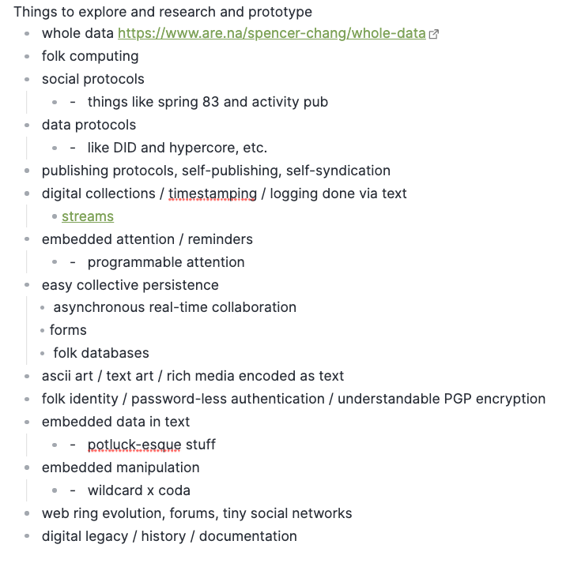

dear reader,

if you’re receiving this it means that i wanted to share some recent personal news with you because i trust you to hold space for it the way i would wish if we were in person together. this is not edited and very raw, so forgive any hanging thoughts or otherwise, and please don't share the link without permission! 

last wednesday I was laid off from coda as the company cut 19% of employees. Just writing those words makes me feel guilty and shameful. To my friends who know this experience personally, I am sorry for not understanding when you shared the news. To others who have had the fortune not to experience this, I don't ever wish this upon you. 

I don't write this to make you feel bad for me or as a plea for help. I am okay, I am doing well, even—I am fortunate to be in a position where I don't have to change my immediate-term plans. 

So how am I feeling? Mostly, I feel overwhelmed by a conflicting set of emotions. I wanted to process these feelings in this letter and share them with those close to me, since I've been having many overlapping conversations in this vein.

Well, this whole letter feels excessively indulgent. I feel like I don't deserve to make a whole big deal out of it, that there are so many worse off: those with conditional visas, those without a few years of savings from working in tech, etc. I also want to appear better than someone who should be offered pity and condolences. I can't help but take the experience personally, as an incontestable indictment on my skills, or at least, how I was perceived by leadership at the company by the end. I've given so much of my life to this company for the past 3.5 years, to the point that it feels hard to immediately separate my identity from the company's. I loved C, loved it and its people to the point that I fooled myself into believing that I had some irrevocable power in shaping its future to match the vision I had. I grew emboldened by how my ambitious, "out there" hackathon projects were received with bright eyes, provoked minds, and aching hearts. I'm known among my friends as "the coda guy." They expect a coda doc to coordinate collaborative activities. And I don't think that that will change—I'm still proud of the work I and the team have done and have not found any adequate replacement for it thus far. But this experience has certainly eroded my trust in leadership and cemented the sinking feeling that my vision for the future of the company was very different from the direction the company is going in. 

I am grieving. For the death of the future of C, one where it becomes a driving vehicle for personal software and folk computing environments. For the death of my life at C, one filled with joyous and idea-filled coworkers, a special shoutout to my designer A who I will miss endlessly. I am mourning the bright-eyed past self who was exposed to tools for thought, Dynamicland, Rick Hickey, Bret Victor, Tools for Conviviality, and more for the first time, and absorbed it all with boundless enthusiasm. One who asked a mentor for advice when they felt overwhelmed with frustration from becoming too intimate with the frustrations of the product for new users. One who discovered the joy of being overwhelmed with ideas for making something different, for making mediums for expression, for creating things that were in themselves an act of expression of personality. I am grieving the naivete with which I attempted to reinvent the world. 

I am still shaken, and events from the day haunt me, replaying in my mind in the moments i least expect. It's hard for me not to dwell, to wonder, to imagine what went on behind the closed doors as people who I had entrusted deliberated whether to break that trust, to sever it without recourse. I feel slightly resentful.

to be honest, i haven’t been able to take the news of others’ layoffs seriously until now. it always felt like an abstract phenomenon. even the phrase is passive. you _are_ _laid off_. you dont do anything. you are deprived of agency. it is an act seemingly of divine will and providence. With all the tech layoffs happening now, there are murmurings of unions, complaints that workers who used to be essential and fought over are now discarded carelessly. At the same time, many are joking about them, poking fun at all the "useless" features that big tech has launched. And still, despite being one of those affected by the sudden plunge into uncertainty, i can see that the world of tech employment has become cushy, bloated. it is a field with a unique amount of leeway and agency, while paying incredibly well, where people can almost make finance-industry-level salaries with the flexibility of freelance with remote work and uncertain work measures (i don't think this is bad per se, given how much money is shoveled into tech, it might as well go to funding some people's livelihoods, but I do hope that everyone can get paid to do something that they love, that they don't identify with the tension and anxiety of "work" but for another time..)

We are squaring two at-odds phenomena, 1) an entirely preventable tragedy of tech worker culling from companies seeking to weather a *coming recession* and having the social acceptability to perform layoffs in *these unprecedented times* and *given the tough macroeconomic conditions* and 2) a probably, long-time-coming re-orienting of priorities and vocations, a violent separation that delivers, along with all the suffering and grief and destabilization, the space to pause, reflect, and reconsider: *who am I? what do I love? And, how will I live now?*. 

i remember joking with A on my team moments before the news. there was an air of invincibility that i felt we were shielded in. i considered the possibility of my layoff in the abstract, but thought it cant be possible. ive given so much. i know so much. i am a joint for intersectional links that cannot be replaced. 5 minutes later I received a formal email titled “Spencer Chang Coda Employment Status.” They had told us before to anticipate and email of two kinds, one, an update on your status (the contents of which would be in the negative) and the other, an invitation to the all hands for tomorrow, after the purge, to chart the way forward and assuage any concerns. the next few hours are a blur to me. i compare them to the shock that numbs all experience in any significantly life-changing event, from a proposal to a tragic accident. factually, it composed of frantically copying important personal documents, using up remaining benefits, and sharing the news while saying hasty goodbyes to shocked coworkers and friends.

Everything about a layoff is odd. It all feels so fake, except for the heartfelt messages between coworkers who were not involved in the decision. those responsible for the decision, for reducing your personhood and future and decisions to line number reductions and extended runway, cover the gamut of what you are supposed to say. they *take full responsibility* and are *deeply sorry*. they recount all your contributions and the legacy you leave. they tell you to be proud, that this was *no fault of your own*, that they are so sorry to see you go and willing to help however they can (the implied part is in the future, in any way detached from the now and your present predicament). They wish you success, but not here and not now. 

Still despite this messy pool of emotions, I am grateful for an end to this chapter and for how much I've grown through it all. I've been telling people this is some sort of divine retribution given how much ive been talking about wanting more free time and joking about how nice it would be to get severance and apply for unemployment. I've been writing a lot about catastrophe and rebirth, and it's as if I got my wish. If we just consider the actual outcome, everything is pretty ideal. i get severance for the next few months, keep my laptop (another item that ive joked about being able to keep when i left), and dont have do any of the offboarding and documentation i’d been dreading. I was already ready for 6 months of an unpaid sabbatical, so this all-in-all is a better alternative that I would probably have chosen (had I been given the choice). 

Part of me is grateful for the violent nature of the separation too. It's forcing me to rapidly disentangle my live and the future of my thinking from being grounded in this company's product, tools, and processes. Grief has been condensed into a few days for a few years of my life. Today was the first day I woke up without having the thoughts of last wednesday morning replay in my head: things like flashes of my horrified, pained manager's face as i couldn't control crying in front of him or how somber and awkward the delivery of the news was from S at the all hands, his internet connection flaky and voice coming in and out as he teed up the announcement. I'm realizing so much of my future of computing thinking finds itself routing back to what you can do in coda, and while I'm still proud of all the work and think it's an unparalleled product on many levels, it is crystal clear to me now that the company is a profit-driven company that can be changed by the whims of leadership at any point. As much as I wanted it to become a medium for personal software creation by common people and pushed my work in the community and the open-source platform work to do so, it is ultimately not my choice, nor in my power to push it in that direction. It feels like a tragedy given how much foundation is there, but I have to internalize that you have to let go of some really great work sometimes if the basis of it all is off. And I will still cherish all of the ideas and thinking that my experience there is undoutedbly inspiring

> Lord, I confess I want the clarity of catastrophe but not the catastrophe.  
> Like everyone else, I want a storm I can dance in.  
> I want an excuse to change my life.
> https://www.theatlantic.com/books/archive/2020/08/poem-franny-choi-catastrophe-next-godliness/615286/
> *(this is also what the obscuring hash in the url is based off of)*
 
Mostly, I am excited. I feel free. I was walking around Oakland the other day in the sun, and I felt so much unseen weight lifted from my shoulders. Nothing about work was *stressful* in the stereotypical sense of the word before, but I didn't realize so much weight had built up from the growing realization that this was not headed in the direction I wanted, I was not being challenged anymore in the ways that I wanted to be, and I increasingly had to force the passion out, like squeezing the last dregs of toothpaste from the bottom of the tube, rather than flowing naturally like a fountain. 

Jacky described my situation very poetically in a way that really resonated. 

i am falling, but i feel my wings tensing. when i breathe, the air goes in deeper, my muscles are lighter. I am ready for reinvention. 

so what am i up to now?

Well—I'm mostly still figuring it out, the details at least, but I'm thinking about *beginnings*. *How will I begin? And how would I live without fear?* 

The grounding direction is that I'm going to do all the things I've been conspiring to do for a long time: explore independent technical research in the future of computing (novel interface design, agentic software creation, etc.) and how to enable more environments for connection through the internet, how to create art that provokes hopeful alternative futures of technology, and learning how to love more fully and deeply, both places and people. Here's a very rough list of questions I'm looking to think, write, and experiment with:

I want to write pieces that act as instruction manuals for my past self, looking to learn, and my future self, looking back, that describe the phenomenon at hand, exploring all the questions and windy *what-ifs* and show real thing that you can play with that demonstrate the concept. 

I want to make software a medium for communal world-building, meaning-making, and beauty-sharing.

I'm making myself a lot more open in this period of exploration, hoping to keep solid chunks of time for talking to people and being exposed to new ideas and life forces. I am happy to catch up and conspire together :)

with a returning abundance of love,
spencer
